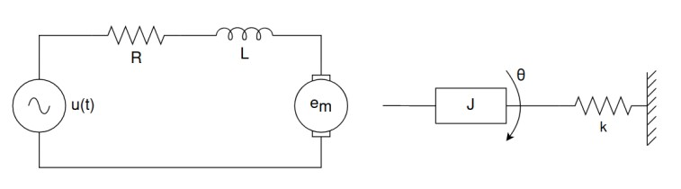
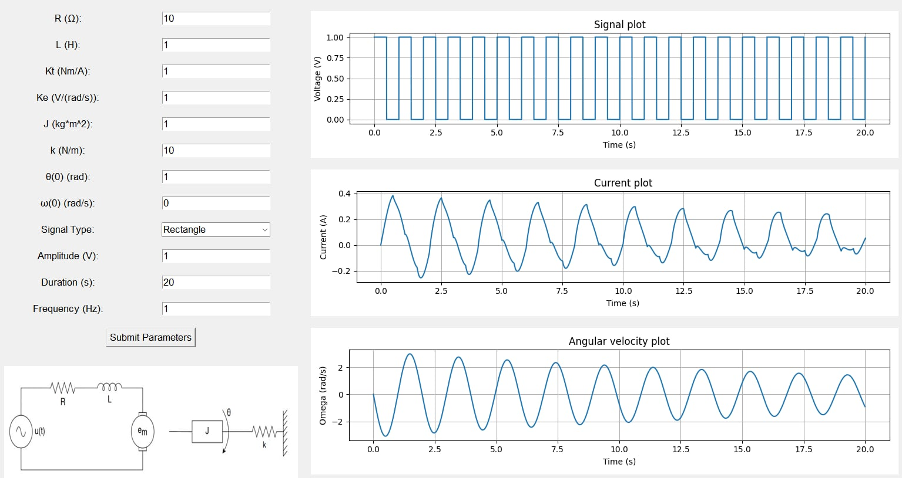
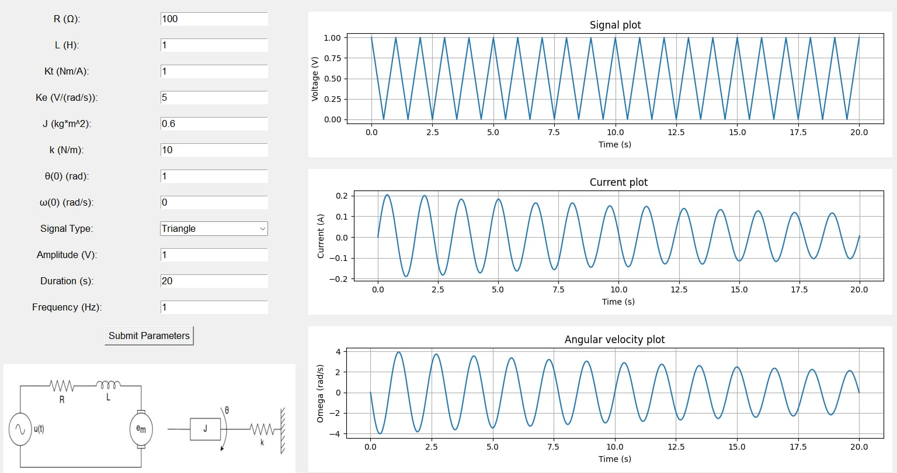
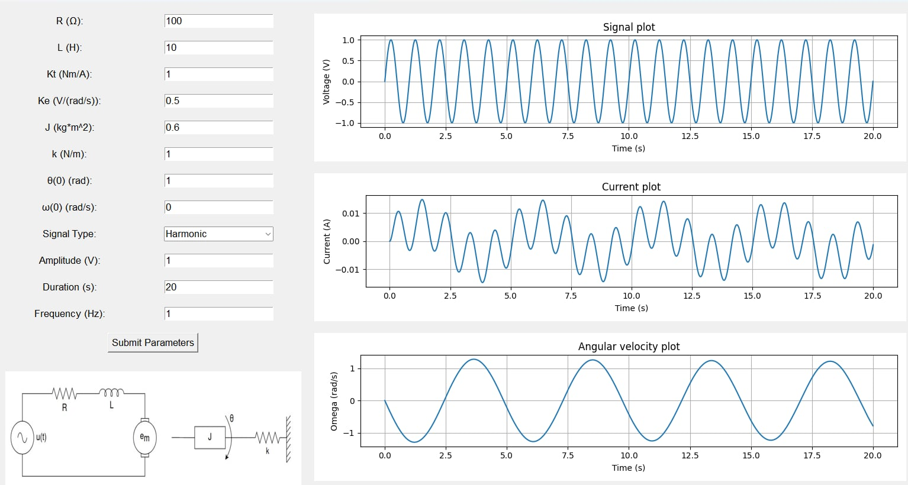

# Electric motor simulation model
## Academic project written in Python simulating a simple electric motor.

This project uses tkinter to provide a simple graphical interface for controlling and plotting the motor parameters such as current [A] and angular velocity [rad/s].

**Schematic of the electric motor modeled in this project is shown below**

**Snapshots from the simulation:**

